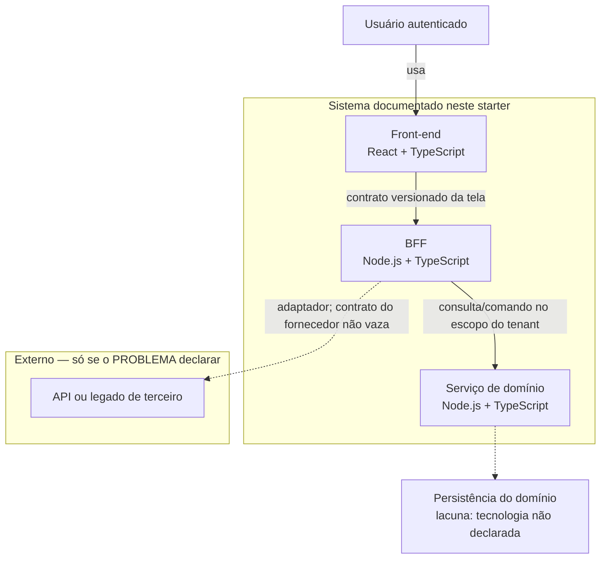

# Starter de arquitetura para aplicações web

Repositório: [ffpaniago/akcit-discovery-documentacao](https://github.com/ffpaniago/akcit-discovery-documentacao).

Base para um time pequeno que mantém um produto web com React, BFF e serviços
Node.js. O material daqui é **insumo para decisão**. A decisão pertence ao time.

Quem escreve neste repositório atua como arquiteto de software sênior e
consultor interno: esclarece fatos, hipóteses, lacunas, contratos e
responsabilidades. Não escolhe sozinho a alternativa vencedora.

## Comece por aqui

1. Preencha o [PROBLEMA](docs/descricao-sistema.md).
2. Siga o contrato em [AGENTS.md](AGENTS.md).
3. Use a [referência mínima de React](docs/next-react.md) em dúvidas de tela.
4. Proponha ADR em `docs/adr/` com status **Proposto**. Aceitação é do time, por PR.

---

## 1. Descrição do sistema (linguagem natural)

**Nível da visão:** containers (inspirado no C4). Não é visão de código
(componentes internos de um serviço) nem de implantação (nós, clusters, regiões).
Também não descreve um produto de negócio concreto: o PROBLEMA em
`docs/descricao-sistema.md` ainda está em placeholders.

### Escopo

Este repositório documenta **como** um produto web deste time deve ser fatiado
e decidido: front React (TypeScript), BFF Node.js/TypeScript e serviços de
domínio Node.js/TypeScript. Inclui contrato de trabalho para agentes, skills
por ferramenta, ADRs e histórico em `memory/`.

**Dentro do escopo desta visão:** pessoa usando o produto; aplicação web;
BFF; serviço de domínio; integração externa **somente quando o PROBLEMA a
declarar**; contrato versionado Front–BFF.

**Fora desta visão:** escolha de nuvem, banco, fila, cache, provedor de
identidade, observabilidade concreta, telas, rotas HTTP e nomes de serviço
de um produto real.

### Limites e responsabilidades

| Container | Responsabilidade | Depende de | Não faz |
|---|---|---|---|
| Front-end React (TypeScript) | Apresentação, estado de tela, acessibilidade, estados loading/erro/vazio | Só o BFF | Chamar domínio ou terceiro; guardar regra ou segredo |
| BFF Node.js (TypeScript) | Agregar, adaptar e reduzir payload; propagar escopo autenticado/tenant; esconder fornecedor | Serviços de domínio e, se declarado, APIs externas | Regra de negócio; banco de domínio |
| Serviço de domínio Node.js (TypeScript) | Dono da regra e do dado | Persistência/fila/cache **já declarados no PROBLEMA** | Delegar decisão de negócio ao front ou ao BFF |

Quebrar o contrato Front–BFF é mudança arquitetural, não refactor.

### Integrações

- **Internas permitidas:** Front → BFF; BFF → domínio.
- **Externas:** o BFF pode chamar terceiros ou legado **se o PROBLEMA declarar**.
  O contrato do fornecedor para no BFF; o front recebe modelo próprio da tela.
- **Proibidas:** Front → domínio; Front → terceiro; BFF → banco de domínio.

Nenhuma integração nomeada (IdP, gateway, provedor de pagamento, etc.) está
declarada neste starter.

### Restrições

- Time pequeno: bus factor baixo; manutenção é custo de primeira ordem.
- Legado e ambientes de terceiros que o time não controla.
- Dados pessoais e segregação por cliente/tenant.
- APIs externas com quota e mudança unilateral de contrato, quando existirem.
- Observabilidade limitada ao que o PROBLEMA declarar. Ferramenta nova é pré-requisito.
- Números, SLAs, custos e volumes não são inventados; mede-se ou registra-se lacuna.

### Fatos, hipóteses e lacunas

**Fatos (deste repositório e do contrato):** as três camadas acima; as
dependências permitidas e proibidas; ADRs revisados por PR; contrato de API
versionado junto do código quando houver implementação.

**Hipóteses (não confirmadas):** um produto real usará Next.js *dentro* do
front; haverá um único BFF e um único serviço de domínio no primeiro recorte;
identidade já chega ao BFF de algum modo.

**Lacunas (não preenchidas em silêncio):**

| Lacuna | Decisão que bloqueia |
|---|---|
| Produto, telas, rotas do BFF e serviços reais | Qual container existe de fato e qual jornada é crítica no negócio |
| Persistência, fila e cache | Se o domínio tem store próprio e qual operação isso adiciona |
| Provedor de identidade e formato do token | Como o BFF autentica e propaga tenant |
| Quais terceiros existem | Se o BFF precisa de adaptador e o que não pode vazar ao front |
| Atributos de qualidade priorizados | Qual alternativa arquitetural recomendar |

---

## 2. Diagrama estrutural — visão de containers

Um nível: pessoas, containers do sistema e sistemas externos. Persistência
aparece só como **lacuna**, não como tecnologia escolhida.



Setas contínuas: dependências permitidas e já assumidas pelo contrato.
Setas tracejadas: integração ou store que **não** estão declaradas no PROBLEMA.

---

## 3. Diagrama comportamental — jornada crítica

Jornada: **abrir uma tela autenticada que precisa de dados de domínio**.
É a jornada crítica deste starter porque atravessa as três camadas e o
contrato Front–BFF. Não é uma jornada de negócio nomeada (checkout, onboarding,
etc.): isso é lacuna do produto.

```mermaid
sequenceDiagram
  actor Usuario
  participant Front as Front React
  participant BFF as BFF Node.js
  participant Dominio as Serviço de domínio
  participant Terceiro as Terceiro (se declarado)

  Usuario->>Front: abre a tela
  Front->>Front: mostra loading; não chama domínio nem terceiro
  Front->>BFF: pede o view model da tela (credencial)
  BFF->>BFF: autentica no limite do BFF e propaga tenant

  BFF->>Dominio: consulta/comando no escopo do tenant
  Dominio-->>BFF: modelo de domínio (regra e dado)

  opt Integração externa declarada no PROBLEMA
    BFF->>Terceiro: chamada via adaptador
    Terceiro-->>BFF: resposta do fornecedor
    BFF->>BFF: traduz para modelo estável da tela
  end

  BFF-->>Front: payload reduzido (sucesso, vazio, parcial ou erro)
  Front-->>Usuario: estados visíveis; sem detalhe de fornecedor
```

---

## 4. Decisões e ajustes sobre o que o modelo gerou

Os diagramas acima foram gerados com GenAI (agente neste repositório) e
depois cortados contra [AGENTS.md](AGENTS.md). O que o modelo tende a
inventar, e o que foi recusado:

| Saída típica do modelo | Ajuste feito | Por quê |
|---|---|---|
| Visão misturando contexto C4, containers, pods e classes num desenho só | Um desenho = containers; outro = sequência | Atributo de clareza da documentação: um nível por diagrama |
| Containers Postgres, Redis, Kafka, API Gateway, Auth0, Kubernetes | Removidos | Persistência, fila, cache, IdP e runtime não estão no PROBLEMA; incluir seria preencher lacuna e somar operação sem justificativa |
| Front Next.js como container obrigatório | Container chamado “Front-end React”; Next.js só em `docs/next-react.md` | O contrato da camada é React + TypeScript; Next.js é estrutura *dentro* do front, se o time já a usar |
| Front → domínio ou Front → terceiro | Removido | Dependência proibida |
| BFF → banco | Removido; store ligado só ao domínio, e como lacuna | BFF não acessa banco de domínio |
| Sequência de um produto inventado (“checkout”, “pagamento”) | Jornada genérica “abrir tela autenticada” | Não há produto preenchido; inventar jornada de negócio seria hipótese vendida como fato |
| SLA, RPS, custo de nuvem nas legendas | Ausentes | Números não inventados |
| Terceiro sempre no caminho feliz | `opt` no Mermaid | Integração externa é condicional ao PROBLEMA |
| Persistência omitida de propósito sem dizer | Caixa explícita de lacuna + seta tracejada | Stakeholder vê o que falta sem ler a conversa |
| ADR já “Aceito” ou alternativa vencedora | Não há ADR aceito nesta entrega | Fora de escopo do contrato; status de decisão continua com o time |

**O que foi mantido da geração:** três containers alinhados à stack; contrato
Front–BFF na aresta; BFF como único ponto para terceiro; estados de tela
explícitos na sequência; propagação de tenant no BFF (restrição recorrente
de segregação, ainda sem IdP nomeado).

---

## Como o time usa este material

Documento de decisão em Markdown, na ordem, pronto para revisão. Modelo em
[`docs/descricao-sistema.md`](docs/descricao-sistema.md).

1. Fatos × hipóteses
2. 6 a 10 perguntas de esclarecimento (sem respondê-las)
3. 3 alternativas (responsabilidade, contrato Front–BFF, trade-off, uso / não uso, esforço, operação)
4. Recomendação condicionada a dois cenários de priorização
5. 6 a 8 riscos em tabela, incluindo vazamento de responsabilidade entre camadas
6. Plano de verificação com as ferramentas já existentes
7. ADR proposto, mudanças de contrato e itens de execução com critério de aceitação
8. Lacunas e a decisão que cada uma bloqueia

### Estrutura do repositório

```text
.
├── README.md                 ← esta descrição e os diagramas
├── AGENTS.md                 ← contrato para agentes e autores
├── docs/
│   ├── descricao-sistema.md
│   ├── next-react.md
│   └── adr/
├── .claude/skills/
├── .agents/skills/
├── .cursor/skills/
└── memory/
```
